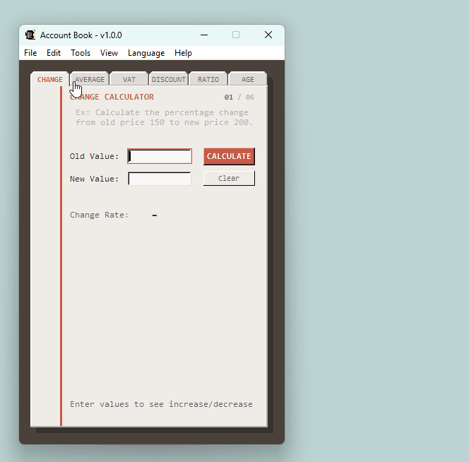

# Hesap Defteri

[](https://python.org)
[](LICENSE.md)
[](https://python.org)
[](requirements.txt)
[](test/)

> A financial and statistical desktop calculator — built with pure `tkinter`, pushed to its engineering limits.

<div align="center">
  
</div>

---

## What makes this technically interesting

This is not a typical tkinter app. Every component that the platform couldn't render correctly was reimplemented from scratch in `tk.Canvas`.

### Custom animated tab bar — `AnimatedTabBar`

`ttk.Notebook` was replaced entirely. The replacement is a `tk.Canvas` subclass that draws all tabs as Windows 98–style beveled polygons: chamfered corners, double-layer highlight/shadow bevel edges, and a shelf line that breaks cleanly under the active tab.

Color transitions run through a `_progress: List[float]` array — one float per tab — animated with **ease-out cubic** over an `after()` loop. Rapid tab switching continues from the current interpolated position rather than resetting.

```python
ease = 1.0 - (1.0 - t) ** 3          # ease-out cubic
bg   = lerp(tab_inactive_bg, bg_secondary, activity)  # per-tab color
```

The canvas background matches the outer frame so clipped polygon corners are invisible — a detail `tk.Button` grids can never achieve.

### Format-agnostic number parsing

A single regex extracts numbers from free text without knowing the locale. Turkish (`1.500,50`) and US (`1,500.50`) thousand-separators are recognized simultaneously — paste a spreadsheet, an e-mail, or an invoice and the engine figures it out.

### `Decimal`-precision finance

All financial calculations use Python's `Decimal`. Float's IEEE 754 accumulation error is non-trivial in VAT chains; this is the right tool.

### Windows 11 square corners via DWM API

```python
ctypes.windll.dwmapi.DwmSetWindowAttribute(
    hwnd, DWMWA_WINDOW_CORNER_PREFERENCE, byref(c_int(DONOTROUND)), sizeof(c_int)
)
```

Called after `deiconify()` so DWM receives the correct HWND. Silently no-ops on older Windows versions.

### Atomic settings persistence

Language preference is written to `%APPDATA%\HesapDefteri\settings.json` via a `.tmp → rename` pattern — the same technique databases use for crash-safe writes. A corrupt or missing file falls back to defaults; unknown JSON keys are whitelisted out rather than forwarded.

### Flicker-free startup

`root.withdraw()` before any I/O, geometry calculated statically, `root.deiconify()` only when everything is ready. The window appears exactly where it should, at full size, on the first frame.

---

## Tools

| # | Tab | Description |
|---|-----|-------------|
| 1 | CHANGE | Percentage change between two values |
| 2 | AVERAGE | Statistical analysis from raw text (mean, median, std dev, range, count) |
| 3 | VAT | VAT calculation — gross-up or net-down |
| 4 | DISCOUNT | Discount / net price calculator |
| 5 | RATIO | Cross-multiplication / proportion |
| 6 | AGE | Exact age, days lived, next birthday countdown |

All results are click-to-copy. Supports Turkish and English UI (`View → Language`; preference is persisted).

---

## Quick start

```bash
git clone https://github.com/zntkr/hesapdefteri.git
cd hesapdefteri
python main.py
```

No `pip install`. No virtual environment. Python 3.8+ is sufficient.

### Standalone Windows executable

```
build.bat
```

Double-click `build.bat`. Installs PyInstaller automatically if missing. Output: `dist/HesapDefteri.exe` — single portable file, no installer required.

---

## Architecture

Three-layer modular monolith. Cross-layer leakage is a hard error.

```
hesapdefteri/
├── main.py                    # Boot: window init, flicker prevention, DWM corners
├── core/
│   ├── matematik_motoru.py    # Stateless: number extraction + statistics (float, 4 dp)
│   ├── finans_motoru.py       # Stateless: VAT, discount, age, ratio (Decimal, 2 dp)
│   ├── ayarlar.py             # Settings: atomic load/save, whitelist validation
│   └── dil.py                 # Localisation: TR / EN string tables
└── ui/
    ├── arayuz_tasarimi.py     # MainUI: theme constants, menus, keyboard shortcuts
    ├── tools_tab.py           # ToolsTab: frame switching, tab orchestration
    ├── animated_tab_bar.py    # AnimatedTabBar: Win98-style custom Canvas tab widget
    ├── base_tool.py           # BaseToolWidget: shared input/output patterns, clipboard
    ├── change_tool.py
    ├── average_tool.py
    ├── tax_tool.py
    ├── discount_tool.py
    ├── proportion_tool.py
    └── age_tool.py
```

**Layer contracts:**
- `core/` → zero tkinter imports, pure functions, `None` on bad input
- `ui/` → zero business logic, state visualisation only
- `main.py` → window bootstrap and event loop only

---

## Design system

| Token | Value | Role |
|-------|-------|------|
| `bg_color` | `#4A423A` | Desk surface (dark walnut) |
| `bg_secondary` | `#EFEBE6` | Paper surface |
| `tab_inactive_bg` | `#E0DCD7` | Inactive tab — one shade darker than paper |
| `input_bg` | `#F9F8F6` | Input fields |
| `accent_color` | `#C85A47` | Terracotta — primary action |
| `shadow_light` | `#FFFFFF` | Bevel highlight edge |
| `shadow_dark` | `#D3CFC8` | Bevel shadow edge |
| `tape_bg` | `#F4F1EA` | Calculator tape (straw paper) |

**Typography** — IBM Plex Mono → Consolas → Courier New → Courier (monospace cascade)

**Skeuomorphism** — Paper pages have physical 3D bevel edges. A 45° desk shadow is simulated with offset dark frames. Binding holes are punched into the left margin. The tab bar is a hand-drawn Canvas, not a widget.

---

## Keyboard shortcuts

| Shortcut | Action |
|----------|--------|
| `Ctrl+1` … `Ctrl+6` | Jump to tool directly |
| `Ctrl+Tab` | Cycle through tools |
| `Enter` | Calculate |
| `Esc` | Clear active tool |
| `Ctrl+H` | Toggle calculator tape |
| `F1` | Open usage guide |

---

## Tests

```bash
python -m unittest discover     # 39 tests
python run_coverage.py          # coverage report (core/ only)
```

Test coverage includes: IEEE 754 precision edge cases, leap-year age calculation (Feb 29 birthdays), TR/US format ambiguity, division by zero, corrupt/missing settings file, `OSError` on save.

---

<details>
<summary>Türkçe</summary>

Türk ofis çalışanları için finansal ve istatistiksel masaüstü hesap makinesi. Standart Python kütüphanesi dışında bağımlılık yok.

**Araçlar:** Değişim oranı · Ortalama/istatistik · KDV · İndirim · Oran/orantı · Yaş hesaplama

**Öne çıkan özellikler:**
- TR ve US sayı formatlarını eş zamanlı tanır — yapıştır ve hesapla
- `Decimal` tabanlı finansal hassasiyet
- Animasyonlu Win98 tarzı özel sekme çubuğu (`tk.Canvas`)
- Tüm sonuçlar tıkla-kopyala
- TR/EN dil desteği, tercih kalıcı olarak kaydedilir
- Windows 11 yuvarlak köşe efekti DWM API ile kapatılmıştır

</details>

---

> *"Does the job and frees the system resources."*
